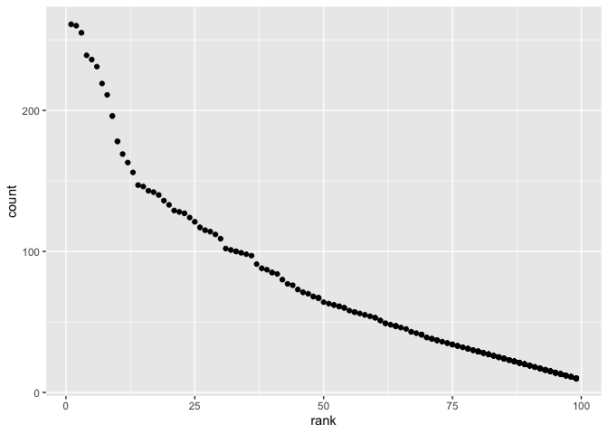

p8105\_hw2\_yg2762
================
Yang Gao
10/1/2021

``` r
library(tidyverse)
```

    ## ── Attaching packages ─────────────────────────────────────── tidyverse 1.3.1 ──

    ## ✓ ggplot2 3.3.5     ✓ purrr   0.3.4
    ## ✓ tibble  3.1.4     ✓ dplyr   1.0.7
    ## ✓ tidyr   1.1.3     ✓ stringr 1.4.0
    ## ✓ readr   2.0.1     ✓ forcats 0.5.1

    ## ── Conflicts ────────────────────────────────────────── tidyverse_conflicts() ──
    ## x dplyr::filter() masks stats::filter()
    ## x dplyr::lag()    masks stats::lag()

``` r
library(readxl)
```

# Problem 1

Read and clean the Mr. Trash Wheel sheet

``` r
trash_wheel_df= read_excel("./data/Trash-Wheel-Collection-Totals-7-2021-sept.xlsx", sheet = "Mr. Trash Wheel", range = "A2:N575") %>% 
  janitor :: clean_names() %>% 
  drop_na(dumpster) %>% 
  mutate (sports_balls = round(sports_balls, digits= 0))

trash_wheel_df
```

    ## # A tibble: 487 × 14
    ##    dumpster month  year date                weight_tons volume_cubic_yards
    ##    <chr>    <chr> <dbl> <dttm>                    <dbl>              <dbl>
    ##  1 1.0      May    2014 2014-05-16 00:00:00        4.31                 18
    ##  2 2.0      May    2014 2014-05-16 00:00:00        2.74                 13
    ##  3 3.0      May    2014 2014-05-16 00:00:00        3.45                 15
    ##  4 4.0      May    2014 2014-05-17 00:00:00        3.1                  15
    ##  5 5.0      May    2014 2014-05-17 00:00:00        4.06                 18
    ##  6 6.0      May    2014 2014-05-20 00:00:00        2.71                 13
    ##  7 7.0      May    2014 2014-05-21 00:00:00        1.91                  8
    ##  8 8.0      May    2014 2014-05-28 00:00:00        3.7                  16
    ##  9 9.0      June   2014 2014-06-05 00:00:00        2.52                 14
    ## 10 10.0     June   2014 2014-06-11 00:00:00        3.76                 18
    ## # … with 477 more rows, and 8 more variables: plastic_bottles <dbl>,
    ## #   polystyrene <dbl>, cigarette_butts <dbl>, glass_bottles <dbl>,
    ## #   grocery_bags <dbl>, chip_bags <dbl>, sports_balls <dbl>,
    ## #   homes_powered <dbl>

Read and clean precipitation data for 2018 and 2019,omit rows without
precipitation data and add a variable for year.

``` r
precip2019_df = read_excel("./data/Trash-Wheel-Collection-Totals-7-2021-sept.xlsx", sheet="2019 Precipitation", range = "A2:B14") %>% 
  janitor :: clean_names() %>% 
  mutate (year = "2019") %>% 
  drop_na()
precip2019_df
```

    ## # A tibble: 12 × 3
    ##    month total year 
    ##    <dbl> <dbl> <chr>
    ##  1     1  3.1  2019 
    ##  2     2  3.64 2019 
    ##  3     3  4.47 2019 
    ##  4     4  1.46 2019 
    ##  5     5  3.58 2019 
    ##  6     6  0.42 2019 
    ##  7     7  3.85 2019 
    ##  8     8  2.39 2019 
    ##  9     9  0.16 2019 
    ## 10    10  5.45 2019 
    ## 11    11  1.86 2019 
    ## 12    12  3.57 2019

``` r
precip2018_df = read_excel ("./data/Trash-Wheel-Collection-Totals-7-2021-sept.xlsx", sheet="2018 Precipitation", range = "A2:B14") %>% 
  janitor :: clean_names() %>% 
  mutate (year = "2018") 
precip2018_df
```

    ## # A tibble: 12 × 3
    ##    month total year 
    ##    <dbl> <dbl> <chr>
    ##  1     1  0.94 2018 
    ##  2     2  4.8  2018 
    ##  3     3  2.69 2018 
    ##  4     4  4.69 2018 
    ##  5     5  9.27 2018 
    ##  6     6  4.77 2018 
    ##  7     7 10.2  2018 
    ##  8     8  6.45 2018 
    ##  9     9 10.5  2018 
    ## 10    10  2.12 2018 
    ## 11    11  7.82 2018 
    ## 12    12  6.11 2018

Combine precipitation datasets and convert month to a character variable

``` r
precip_df = 
  bind_rows (precip2018_df, precip2019_df) %>% 
  relocate (year) %>% 
  mutate(month = month.name[month])
precip_df
```

    ## # A tibble: 24 × 3
    ##    year  month     total
    ##    <chr> <chr>     <dbl>
    ##  1 2018  January    0.94
    ##  2 2018  February   4.8 
    ##  3 2018  March      2.69
    ##  4 2018  April      4.69
    ##  5 2018  May        9.27
    ##  6 2018  June       4.77
    ##  7 2018  July      10.2 
    ##  8 2018  August     6.45
    ##  9 2018  September 10.5 
    ## 10 2018  October    2.12
    ## # … with 14 more rows

Mr. Trash Wheel data `trash_wheel_df` contains 487 observations and 14
variables; the precipitation dataset`precip_df` contains 24 observations
and 3 variables. The total precipitation in 2018 is
`sum (pull(precip2018_df, total))`, the median number of sports balls in
a dumpster in 2019 is
`trash_wheel_2019=filter(trash_wheel_df, year == 2019)`
`median (pull (trash_wheel_2019, sports_balls ))`

``` r
trash_wheel_df
precip_df


sum (pull(precip2018_df, total))

trash_wheel_2019=filter(trash_wheel_df, year == 2019)
median (pull (trash_wheel_2019, sports_balls ))
```

# Problem 2

clean up pol-month.csv

``` r
pols_month_df = read_csv("./data/pols-month.csv") %>% 
  janitor :: clean_names () %>% 
  separate(mon, into = c ("year", "month", "day"), sep ="-", convert = TRUE )%>% 
  mutate (month = month.name[month]) %>% 

  mutate (prez_dem = recode (prez_dem, `1` ="dem", `0`= "no")) %>% 
  mutate (prez_gop = recode (prez_gop, `1` ="gop", `0`= "no") )%>% 
  mutate (president = if_else(prez_dem == "dem", "dem", "gop")) %>% 
  select (-prez_dem, -prez_gop) %>% 
  select (-day)
```

    ## Rows: 822 Columns: 9

    ## ── Column specification ────────────────────────────────────────────────────────
    ## Delimiter: ","
    ## dbl  (8): prez_gop, gov_gop, sen_gop, rep_gop, prez_dem, gov_dem, sen_dem, r...
    ## date (1): mon

    ## 
    ## ℹ Use `spec()` to retrieve the full column specification for this data.
    ## ℹ Specify the column types or set `show_col_types = FALSE` to quiet this message.

    ## Warning: Unreplaced values treated as NA as .x is not compatible. Please specify
    ## replacements exhaustively or supply .default

``` r
pols_month_df
```

    ## # A tibble: 822 × 9
    ##     year month     gov_gop sen_gop rep_gop gov_dem sen_dem rep_dem president
    ##    <int> <chr>       <dbl>   <dbl>   <dbl>   <dbl>   <dbl>   <dbl> <chr>    
    ##  1  1947 January        23      51     253      23      45     198 dem      
    ##  2  1947 February       23      51     253      23      45     198 dem      
    ##  3  1947 March          23      51     253      23      45     198 dem      
    ##  4  1947 April          23      51     253      23      45     198 dem      
    ##  5  1947 May            23      51     253      23      45     198 dem      
    ##  6  1947 June           23      51     253      23      45     198 dem      
    ##  7  1947 July           23      51     253      23      45     198 dem      
    ##  8  1947 August         23      51     253      23      45     198 dem      
    ##  9  1947 September      23      51     253      23      45     198 dem      
    ## 10  1947 October        23      51     253      23      45     198 dem      
    ## # … with 812 more rows

clean up snp.csv

``` r
snp_df = read_csv("./data/snp.csv") %>% 
  janitor :: clean_names() %>% 
  separate(date, into =c ("month", "day", "year"), sep = "/", convert =TRUE) %>% 
  mutate (month = month.name[month]) %>% 
  select (-day) %>% 
  mutate (year = if_else(year>15, year + 1900, year + 2000)) %>% 
  relocate (year, month)
```

    ## Rows: 787 Columns: 2

    ## ── Column specification ────────────────────────────────────────────────────────
    ## Delimiter: ","
    ## chr (1): date
    ## dbl (1): close

    ## 
    ## ℹ Use `spec()` to retrieve the full column specification for this data.
    ## ℹ Specify the column types or set `show_col_types = FALSE` to quiet this message.

``` r
snp_df
```

    ## # A tibble: 787 × 3
    ##     year month    close
    ##    <dbl> <chr>    <dbl>
    ##  1  2015 July     2080.
    ##  2  2015 June     2063.
    ##  3  2015 May      2107.
    ##  4  2015 April    2086.
    ##  5  2015 March    2068.
    ##  6  2015 February 2104.
    ##  7  2015 January  1995.
    ##  8  2014 December 2059.
    ##  9  2014 November 2068.
    ## 10  2014 October  2018.
    ## # … with 777 more rows

Tidy the unemployment data

``` r
unemployment_df = read_csv( "./data/unemployment.csv" ) %>% 
  janitor :: clean_names() %>% 
  pivot_longer(
    jan:dec,
    names_to = "month",
    values_to = "unemployment"
  ) %>% 
  mutate(month = factor(month)) %>% 
  mutate (month = month.name[month])
```

    ## Rows: 68 Columns: 13

    ## ── Column specification ────────────────────────────────────────────────────────
    ## Delimiter: ","
    ## dbl (13): Year, Jan, Feb, Mar, Apr, May, Jun, Jul, Aug, Sep, Oct, Nov, Dec

    ## 
    ## ℹ Use `spec()` to retrieve the full column specification for this data.
    ## ℹ Specify the column types or set `show_col_types = FALSE` to quiet this message.

``` r
unemployment_df
```

    ## # A tibble: 816 × 3
    ##     year month     unemployment
    ##    <dbl> <chr>            <dbl>
    ##  1  1948 May                3.4
    ##  2  1948 April              3.8
    ##  3  1948 August             4  
    ##  4  1948 January            3.9
    ##  5  1948 September          3.5
    ##  6  1948 July               3.6
    ##  7  1948 June               3.6
    ##  8  1948 February           3.9
    ##  9  1948 December           3.8
    ## 10  1948 November           3.7
    ## # … with 806 more rows

Join the datasets by merging `snp` into `pols`, and merging
`unemployment` into the result.

``` r
snp_pol_df = 
  dplyr ::left_join (pols_month_df, snp_df, by = c("year", "month"))

snp_pol_df
```

    ## # A tibble: 822 × 10
    ##     year month   gov_gop sen_gop rep_gop gov_dem sen_dem rep_dem president close
    ##    <dbl> <chr>     <dbl>   <dbl>   <dbl>   <dbl>   <dbl>   <dbl> <chr>     <dbl>
    ##  1  1947 January      23      51     253      23      45     198 dem          NA
    ##  2  1947 Februa…      23      51     253      23      45     198 dem          NA
    ##  3  1947 March        23      51     253      23      45     198 dem          NA
    ##  4  1947 April        23      51     253      23      45     198 dem          NA
    ##  5  1947 May          23      51     253      23      45     198 dem          NA
    ##  6  1947 June         23      51     253      23      45     198 dem          NA
    ##  7  1947 July         23      51     253      23      45     198 dem          NA
    ##  8  1947 August       23      51     253      23      45     198 dem          NA
    ##  9  1947 Septem…      23      51     253      23      45     198 dem          NA
    ## 10  1947 October      23      51     253      23      45     198 dem          NA
    ## # … with 812 more rows

``` r
final_df =
  left_join (snp_pol_df, unemployment_df, by= c("year", "month"))


final_df
```

    ## # A tibble: 822 × 11
    ##     year month   gov_gop sen_gop rep_gop gov_dem sen_dem rep_dem president close
    ##    <dbl> <chr>     <dbl>   <dbl>   <dbl>   <dbl>   <dbl>   <dbl> <chr>     <dbl>
    ##  1  1947 January      23      51     253      23      45     198 dem          NA
    ##  2  1947 Februa…      23      51     253      23      45     198 dem          NA
    ##  3  1947 March        23      51     253      23      45     198 dem          NA
    ##  4  1947 April        23      51     253      23      45     198 dem          NA
    ##  5  1947 May          23      51     253      23      45     198 dem          NA
    ##  6  1947 June         23      51     253      23      45     198 dem          NA
    ##  7  1947 July         23      51     253      23      45     198 dem          NA
    ##  8  1947 August       23      51     253      23      45     198 dem          NA
    ##  9  1947 Septem…      23      51     253      23      45     198 dem          NA
    ## 10  1947 October      23      51     253      23      45     198 dem          NA
    ## # … with 812 more rows, and 1 more variable: unemployment <dbl>

The `pols_month_df` contains 822 observations of 9 variables related to
the number of national politicians who are democratic or republican at
any given time, and wheather the president is democratic or republican
at that given time; the `snp_df` contains 787 observations of 3
variables of the closing values of the S&P stock index on the associated
month; the `unemployment_df` shows the percentage of unemployment in
months of the associated year. The result dataset `final_df` contains
822 observations and 11 variables, with the year range from 1947 to
2015, key variables are year, month, president, closing value and
unemployment rate.

# Problem 3

Tidy data

``` r
baby_name_df =read_csv("./data/Popular_Baby_Names.csv") %>% 
  janitor:: clean_names() %>% 
  distinct() %>% 
  mutate(ethnicity = str_to_lower(ethnicity)) %>% 
  mutate(childs_first_name = str_to_lower (childs_first_name)) %>% 
  
  mutate(ethnicity = replace (ethnicity, ethnicity == "asian and paci", "asian and pacific islander")) %>% 
  mutate(ethnicity = replace (ethnicity, ethnicity == "black non hisp", "black non hispanic")) %>% 
  mutate(ethnicity = replace (ethnicity, ethnicity == "white non hisp", "white non hispanic"))
```

    ## Rows: 19418 Columns: 6

    ## ── Column specification ────────────────────────────────────────────────────────
    ## Delimiter: ","
    ## chr (3): Gender, Ethnicity, Child's First Name
    ## dbl (3): Year of Birth, Count, Rank

    ## 
    ## ℹ Use `spec()` to retrieve the full column specification for this data.
    ## ℹ Specify the column types or set `show_col_types = FALSE` to quiet this message.

``` r
baby_name_df
```

    ## # A tibble: 12,181 × 6
    ##    year_of_birth gender ethnicity                  childs_first_name count  rank
    ##            <dbl> <chr>  <chr>                      <chr>             <dbl> <dbl>
    ##  1          2016 FEMALE asian and pacific islander olivia              172     1
    ##  2          2016 FEMALE asian and pacific islander chloe               112     2
    ##  3          2016 FEMALE asian and pacific islander sophia              104     3
    ##  4          2016 FEMALE asian and pacific islander emily                99     4
    ##  5          2016 FEMALE asian and pacific islander emma                 99     4
    ##  6          2016 FEMALE asian and pacific islander mia                  79     5
    ##  7          2016 FEMALE asian and pacific islander charlotte            59     6
    ##  8          2016 FEMALE asian and pacific islander sarah                57     7
    ##  9          2016 FEMALE asian and pacific islander isabella             56     8
    ## 10          2016 FEMALE asian and pacific islander hannah               56     8
    ## # … with 12,171 more rows

rank in popularity of the name “Olivia” as a female baby name over time;

``` r
olivia_df = baby_name_df %>% 
  filter (childs_first_name == "olivia", gender == "FEMALE") %>% 
  select(-"gender", -"childs_first_name", -"count") %>% 
  pivot_wider(
    names_from = "year_of_birth",
    values_from = "rank"
  )
  
knitr :: kable(olivia_df)
```

| ethnicity                  | 2016 | 2015 | 2014 | 2013 | 2012 | 2011 |
|:---------------------------|-----:|-----:|-----:|-----:|-----:|-----:|
| asian and pacific islander |    1 |    1 |    1 |    3 |    3 |    4 |
| black non hispanic         |    8 |    4 |    8 |    6 |    8 |   10 |
| hispanic                   |   13 |   16 |   16 |   22 |   22 |   18 |
| white non hispanic         |    1 |    1 |    1 |    1 |    4 |    2 |

showing the most popular name among male children over time.

``` r
male_name_df = baby_name_df %>% 
  filter (gender == "MALE" , rank == 1) %>% 
  select(-"rank", -"count", -"gender") %>% 
  pivot_wider(
    names_from = "year_of_birth",
    values_from = "childs_first_name"
  )
  
knitr :: kable(male_name_df)
```

| ethnicity                  | 2016   | 2015   | 2014   | 2013   | 2012   | 2011    |
|:---------------------------|:-------|:-------|:-------|:-------|:-------|:--------|
| asian and pacific islander | ethan  | jayden | jayden | jayden | ryan   | ethan   |
| black non hispanic         | noah   | noah   | ethan  | ethan  | jayden | jayden  |
| hispanic                   | liam   | liam   | liam   | jayden | jayden | jayden  |
| white non hispanic         | joseph | david  | joseph | david  | joseph | michael |

For male, white non-hispanic children born in 2016, produce a scatter
plot showing the number of children with a name (y axis) against the
rank in popularity of that name (x axis).

``` r
plot_df = baby_name_df %>% 
  filter (gender == "MALE", year_of_birth == "2016", ethnicity == "white non hispanic") %>% 
  relocate(childs_first_name)
plot_df
```

    ## # A tibble: 364 × 6
    ##    childs_first_name year_of_birth gender ethnicity          count  rank
    ##    <chr>                     <dbl> <chr>  <chr>              <dbl> <dbl>
    ##  1 joseph                     2016 MALE   white non hispanic   261     1
    ##  2 michael                    2016 MALE   white non hispanic   260     2
    ##  3 david                      2016 MALE   white non hispanic   255     3
    ##  4 moshe                      2016 MALE   white non hispanic   239     4
    ##  5 jacob                      2016 MALE   white non hispanic   236     5
    ##  6 james                      2016 MALE   white non hispanic   231     6
    ##  7 benjamin                   2016 MALE   white non hispanic   219     7
    ##  8 alexander                  2016 MALE   white non hispanic   211     8
    ##  9 daniel                     2016 MALE   white non hispanic   196     9
    ## 10 henry                      2016 MALE   white non hispanic   196     9
    ## # … with 354 more rows

``` r
ggplot(plot_df, aes(x=rank, y=count)) + geom_point()
```

<!-- -->
